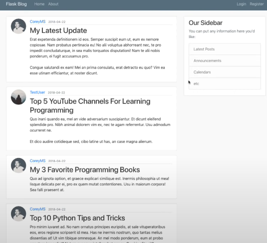

## Intro
Basically we will be building a blog style application , something that looks like this .\
Multiple users can be registered , there will be a login page , a resettable password , account info , profile picture etc. A fullblown blog page.

We wil have to deal with 
- Databases
- Form inputs
- Saving pictures into a backend File system
- Sending Emails for Resetting passwords

&nbsp; 

## Required Packages
