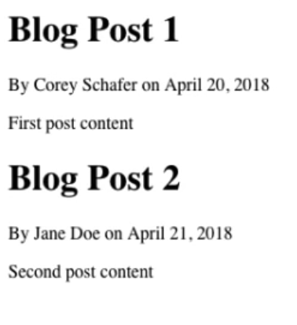
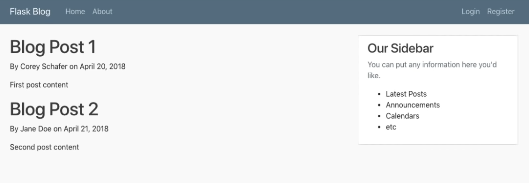

## Templates with jinja2 and BootStrap
We would like to go from this 



To this 




We can access html templates using flask.render_template
```python
from flask import Flask,render_template,url_for
app = Flask(__name__)

@app.route("/")
@app.route("/home")
posts = [{},{}]
def home():
    return render_template('home.html', posts = posts)


```

note that the posts variable can be anything , and it can be accessed via jinja2 templating.

Also , to reduce redundancy , we use layout.html to set a base page for all our other pages , below is an example with jinja2.

```html 
<!DOCTYPE html>
<html lang="en">
<head>
    
        <title>Flask Blog - {{ title }} </title>
    
        <title>Flask Blog </title>
    
</head>
    
<body>

</body>
</html>



```

We can use if template in heading for editing headings directly in the render_template call. And the block named content can be used to fill in other html files , for example home.html shows our blog page. 

```html


    
    <article class="media content-section">
        <div class="media-body">
          <div class="article-metadata">
            <a class="mr-2" href="#">{{ post.author }}</a>
            <small class="text-muted">{{ post.date_posted }}</small>
          </div>
          <h2><a class="article-title" href="#">{{ post.title }}</a></h2>
          <p class="article-content">{{ post.content }}</p>
        </div>
      </article> 
    


```
This home.html uses layout.html's block named content , to fill in all the blog posts using a for loop made with jinja2 engine.

And the rest of the video showcases about bootstrap elements and how we can have a custom css file ( see video for more details on this)